# BallN

Balln is a blog website provided for both football lovers and non football lover who wants to learn more about football and get recent information about what is currently happening in the world of football. There are different posts which provides different information on what to look out for in football right now. It is an interactive page that allows Users to be able to show love for certain poosts and also share their thoughts about what they feel about a particular post in order to invoke conversation. BallN blog allows for convesation to be had and acquiring knowledge about certain topics in football.

[Link to BallN Here!](https://balln.herokuapp.com/)

## Contents
- [User Experience (UX)](#User-Experience-UX)
   - [Aim](#Aim)
   - [Target Audience](#Target-Audience)
   - [User Stories](#User-Stories)
      - [Admin Stories](#Admin-Stories)
      - [User Stories](#User-Stories)
   - [User Goals](#User-Goals)
      - [First Time Users](#First-Time-Users)
      - [Revisiting Users](#Revisiting-Users)

- [Design](#Design)
   - [Typography](#Typography)
   - [Wireframes](#Wireframes)
   - [Entity Relationship Diagram](#Entity-Relationship-Diagram)

- [Features](#Features)
   - [Existing Features](#Existing-Features)
      - [Home](#Home)
      - [Navigation](#Navigation)
      - [Post Detail](#Post-Detail)
      - [Category](#Category)
      - [Footer Links](#Footer-Links)
   - [C.R.U.D:](#C.R.U.D:)
      - [Create Comment](#Create-Comment)
      - [Read Comment](#Read-Comment)
      - [Edit Comment Page](#Edit-Comment-Page)
      - [Delete Comment Page](#Delete-Comment-Page)
      - [Admin Page](#Admin-Page)
      - [Register Page](#Register-Page)
      - [Login Page](#Login-Page)
      - [Logout Page](#Logout-Page)
   - [Features Left to Implement](#Features-Left-to-Implement)

- [Technologies Used](#Technologies-Used)
   - [Languages Used](#Languages-Used)
   - [Frameworks, Libraries And Programs Used](#Frameworks-Libraries-And-Programs-Used)
      - [Balsamiq](#Balsamiq)
      - [Smartdraw](#Smartdraw)
      - [Git](#Git)   
      - [Gitpod](#Gitpod)
      - [Github](#Github)
      - [Gitpod Python Essentials Template](#Gitpod-Python-Essentials-Template)
      - [Heroku](#Heroku)
      - [PostgreSQL](#PostgreSQL)
      - [ElephantSQL](#ElephantSQL)
      - [Google Fonts](#Google-Fonts)
      - [Favicon](#Favicon)

- [Testing](#Testing)
   - [Manual Testing](#Manual-Testing)
   - [Automated Testing](#Automated-Testing)
   - [Validator Testing](#Validator-Testing)
      - [HTML Validator](#HTML-Validator) 
      - [CSS Validator](#CSS-Validator) 
      - [Lighthouse Validator](#Lighthouse-Validator) 
      - [PEP8 Online](#PEP8-Online)
   - [Bugs Encountered And Solutions](#Bugs-Encountered-And-Solutions)   
   - [Unfixed Bugs](#Unfixed-Bugs)

- [Deployment](#Deployment)
   - [Step 1](#Step-1)
   - [Step 2](#Step-2)
   - [Step 3](#Step-3)

- [Credits](#Credits)
   - [Content](#Content)
   - [Media](#Content)
   - [Acknowledgments](#Acknowledgments)

## User Experience (UX)

### Aim
The aim of this site is to provide a space for people to view post about current matters in football. The site is to bring together numerous football fans around the world connecting via these blog posts. The posts ranges from information about players to football technologies and history about football. The site allows users to be able to interact with the blog posts via likes and comments to spark up conversation and share their thoughts about the post. 

### Target Audience
For all football lovers and non football lovers that would like to view posts about the current state of world football. 

### User Stories
#### Admin Stories
- As a Site Admin I can create, read, update and delete posts so that I can manage my blog content
- As a Site Admin I can create draft posts so that I can finish writing the content later
- As a Site Admin I can approve or disapprove comments so that I can filter out objectionable comments

#### User Stories
- As a Site User I can view a paginated list of posts so that I can select which post I want to view.
- As a Site User I can view a list of posts so that I can select one to read
- As a Site User / Admin I can view the number of likes on each post so that I can see which is the most popular or viral
- As a Site User I can click on a post so that I can read the full text
- As a Site User / Admin I can view comments on an individual post so that I can read the conversation
- As a Site User I can register an account so that I can comment and like
- As a Site User I can leave comments on a post so that I can be involved in the conversation
- As a Site User I can like or unlike a post so that I can interact with the content
- As a Site User I can choose which category of post so that I can read specific posts related to the category of choice

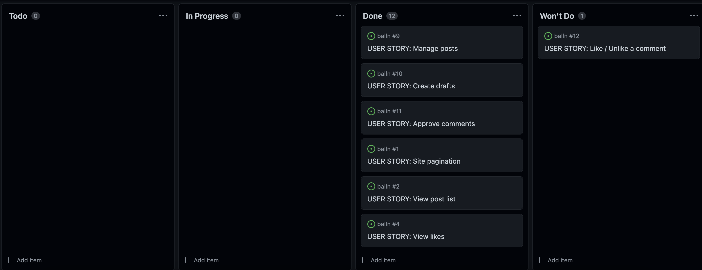

### User Goals

#### First Time Users
- As a first time user, I want to be able access the site.
- As a first time user, I would like information on how to navigate the site.
- As a first time user, I want to be able to register to the site.
- As a first time user, I want to be able to view posts.
- As a first time user, I want to be able to like and unlike posts.
- As a first time user, I want to be able to choose specific categories for posts.

#### Revisting Users
- As a revisiting user, I want to be able to login back into the site.
- As a revisiting user, I want to be able to view posts.
- As a revisiting user, I want to be able to be able to like and unlike posts.
- As a revisiting user, I want to be able to be able to edit own comments.

## Design

### Typography
All fonts from this site were taken from Google Fonts.

### Wireframes
#### Home:
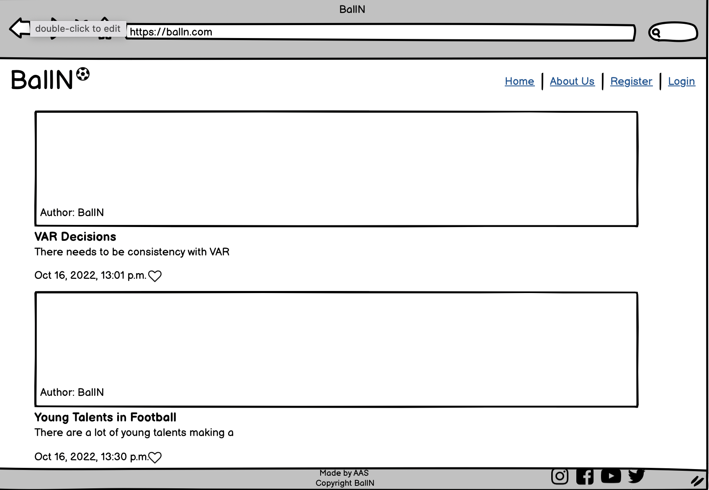
#### Post Detail:
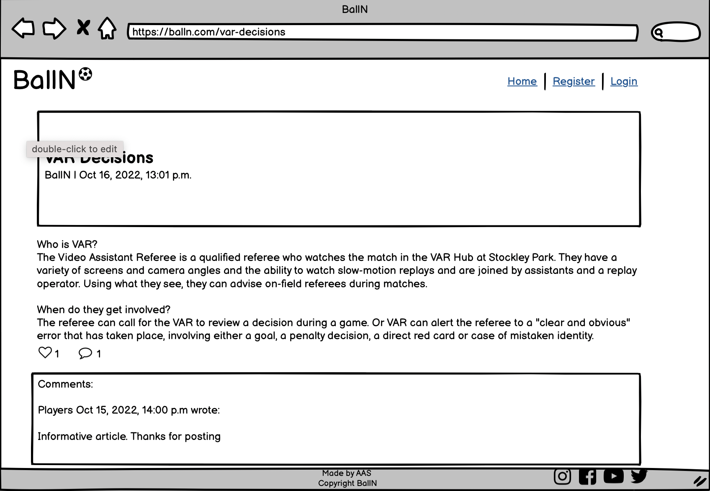
#### Sign In:
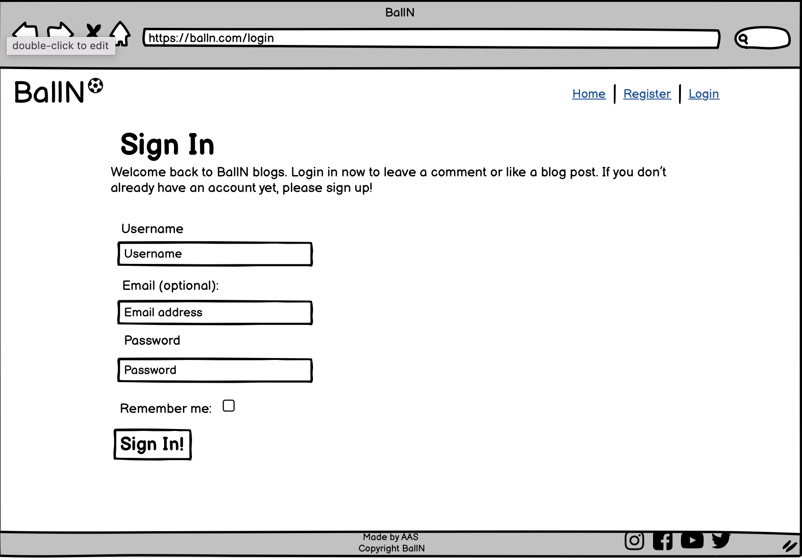
#### Sign Up:
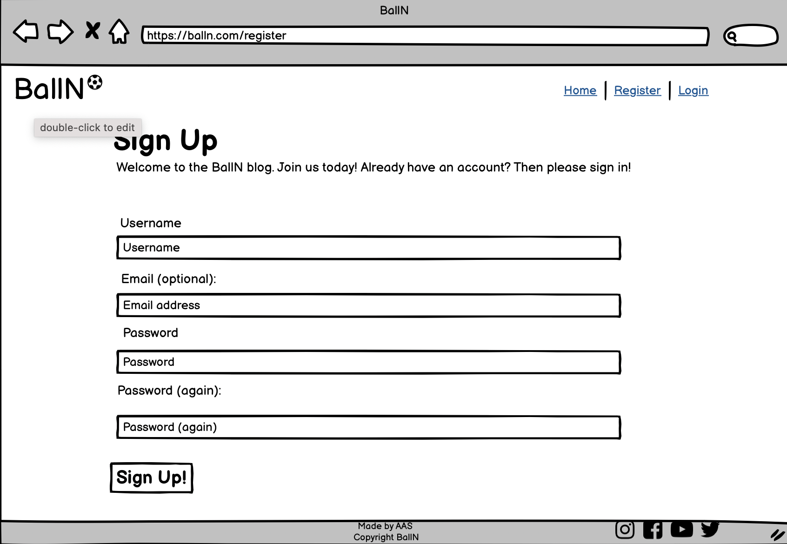

### Entity Relationship Diagram
- ERD for Post
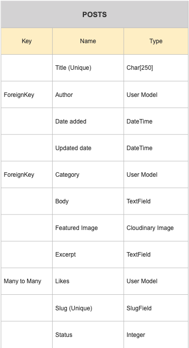
- ERD for Comments

- ERD for Category

## Features

### Existing Features

#### Home

#### Navigation

#### Post Detail
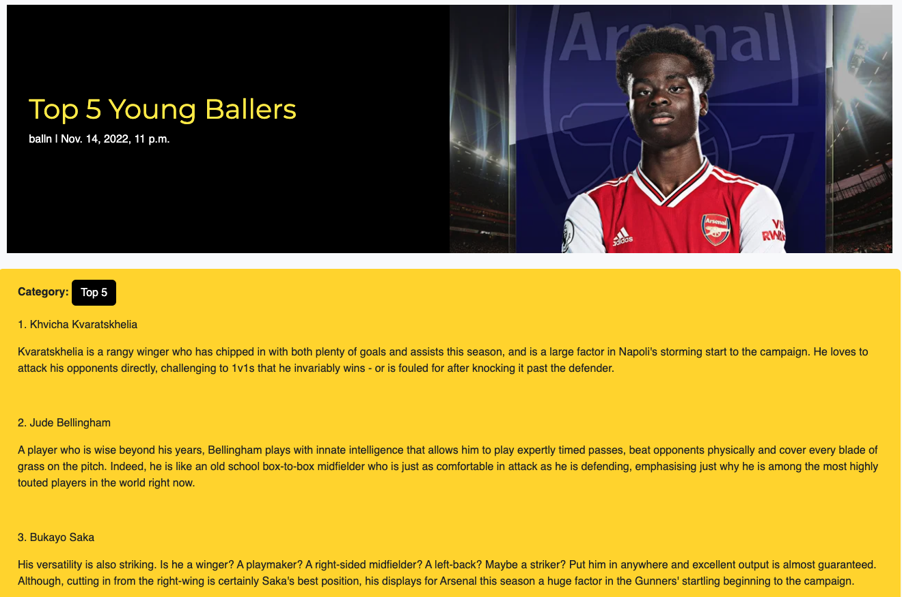

#### Category

#### Footer Links

### C.R.U.D:

#### Create Comment
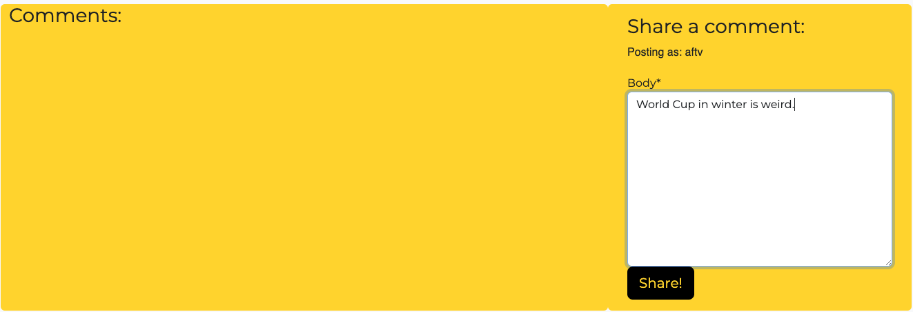

#### Read Comment
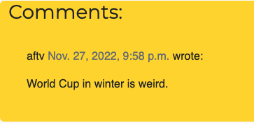
#### Edit Comment Page
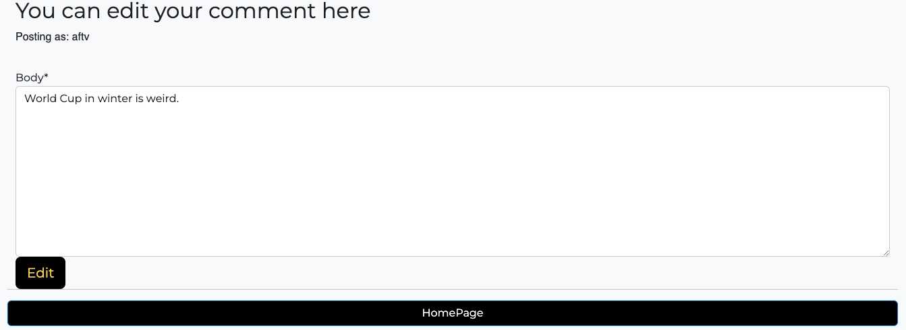
#### Delete Comment Page
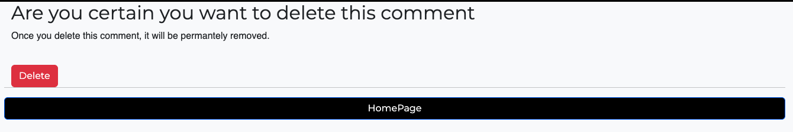
#### Admin Page
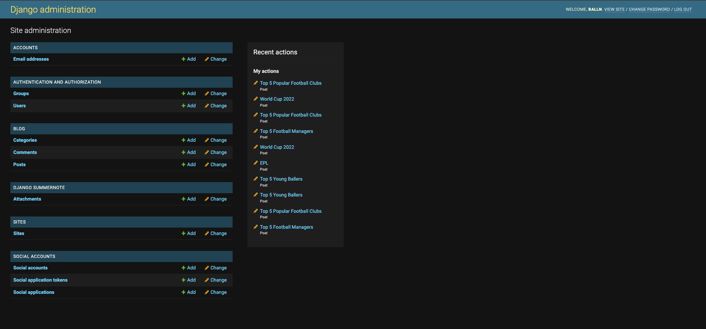
#### Register Page
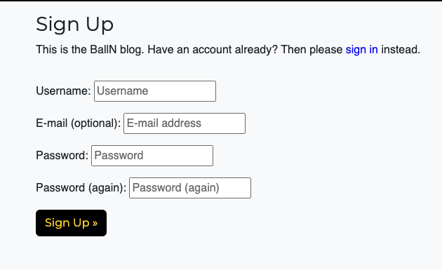
#### Login Page
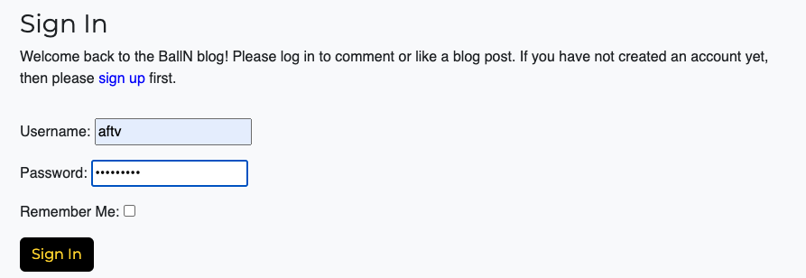

#### Logout Page

### Features Left to Implement
- To add another model to which users are able to like / unlike other users comments.
- To add another model to which users are able to reply to other users comments.
- To add highlight videos of football matches on the home page.
- To add categories section on the home page.

## Technologies Used

### Languages Used
- [HTML5](https://en.wikipedia.org/wiki/HTML)
- [CSS](https://en.wikipedia.org/wiki/CSS)
- [JavaScript](https://en.wikipedia.org/wiki/JavaScript)
- [Python](https://en.wikipedia.org/wiki/Python_(programming_language))
- [Django](https://www.djangoproject.com/)

### Frameworks, Libraries And Programs Used 

1. #### [Balsamiq](https://balsamiq.com/)
   - Balsamiq was used to create the basic frameworks of the project to which helped to coding the website.

2. #### [Smartdraw](https://www.smartdraw.com/)
   - Smartdraw was used to create my Entity Relationship Diagram to help structure the database scheme.

3. #### [Git:](https://git-scm.com/)
   - Git was used in the Gitpod terminal to add, commit and push code to Github.

4. #### [Gitpod:](https://www.gitpod.io/)
   - Gitpod is the Integrated Developer Environment used to code this project.

5. #### [Github:](https://github.com/)
   - Github was used to hold and keep the pushed codes by Git and store projects.

6. #### [Gitpod Python Essentials Template:](https://github.com/Code-Institute-Org/python-essentials-template)
   - Gitpod Python Essentials Template was provided by code institute and it consisted of all the relevant tools needed for the successful running of the application.

7. #### [Heroku](https://id.heroku.com/login)
   - Heroku was used to deploy the project.

8. #### [PostgreSQL](https://www.postgresql.org/)
   - This was used for database.

9. #### [ElephantSQL](https://www.elephantsql.com/)
   - This was used as the new database.

10. #### [Google Fonts](https://fonts.google.com/about)
   - This was used to form the fonts for the page.

11. #### [Favicon](https://www.favicon.cc/)
   - This was used to create an icon for the site tab.

### Installed Packages:
   - 'django.contrib.admin',
   - 'django.contrib.auth',
   - 'django.contrib.contenttypes',
   -  'django.contrib.sessions',
   -  'django.contrib.messages',
   -  'django.contrib.sites',
   -  'allauth',
   -  'allauth.account',
   -  'allauth.socialaccount',
   -  'cloudinary_storage',
   -  'django.contrib.staticfiles',
   -  'cloudinary',
   -  'django_summernote',
   -  'crispy_forms',
   -  'blog',

## Testing

### Manual Testing
   #### Manual Testing on UI
   - The home page loads up as normal. 
   - The logo on the home page works as it loads the home page when clicked.
   - The home navigation redirects to home when clicked on.
   - The register navigation loads to the sign up page. The form page was manually tested by inserting information to which signed up to website.
   - Now logged when signed up, the logout page directs you to a sign out page and when click sign out button it logs you out.
   - Login form works and logs in user when filled correctly.
   - Each read more button works for all posts on the home page when clicked on to which take you to the post in detailed form.
   - The next button at the bottom of the page works as it take you to the next page when clicked.
   - Footer links works as it directs you to each social media page when clicked on.
   - When logged in the heart button works when clicked and hearts the post.
   - The comment body was tested and  worked as when logged in can comment and view comments. When logged in edit and delete button works as it should.
   - The category button works to which takes you to a different page when clicked on. On this category page, all the relevant post under that categories was visible.
   - The like button doesn't work when not signed in and comment section doesn't show when not signed up or signed in.
   - Interaction on a post cannot be accessed when using a signed in link page to another browser such as incognito and will need to sign in again.
   
   #### Manual Testing on Deployment in Heroku
   - Posts are able to be created as normal.
   - Comments were able to be approved and deleted.
   - Categories tested fine and more categories can be added.
   - Users can't gain access to the admin page and will be asked to have login for it.

   #### Manual Testing on Deployment in Heroku
    - Deployment of app works when automatically deployed to Heroku.

### Automated Testing
   #### UnitTest

### Validator Testing
#### [HTML Validator](https://validator.w3.org/nu/)
   - Below HTML files passed through [W3C Validator](https://validator.w3.org/nu/) with no errors found.
   - Home 
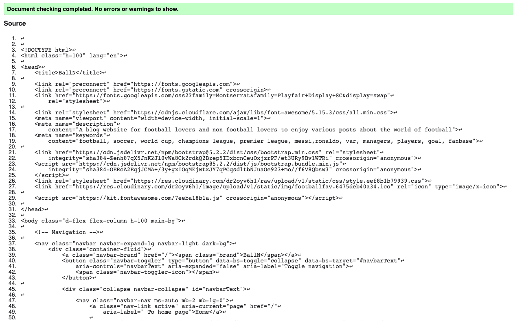
   - Post detail
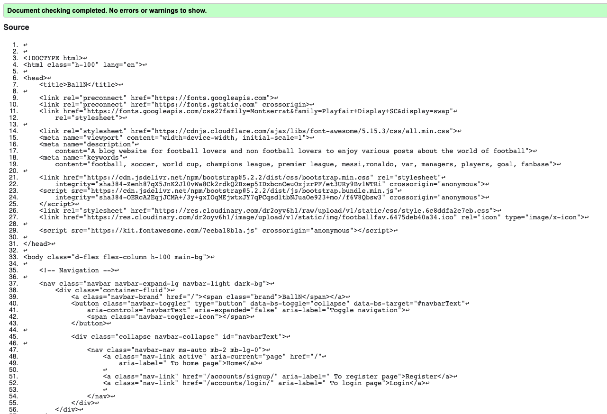
   - Signup
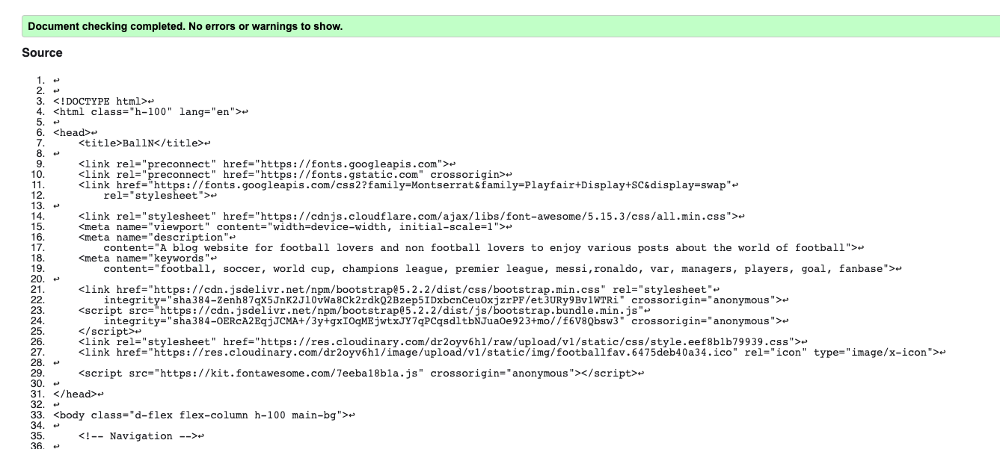
   - Login
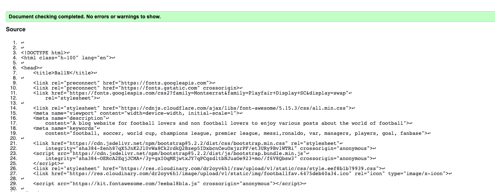

#### [CSS Validator](https://jigsaw.w3.org/css-validator/)
   - CSS files passed through [Jigsaw Validator](https://jigsaw.w3.org/css-validator/) with no errors found. 
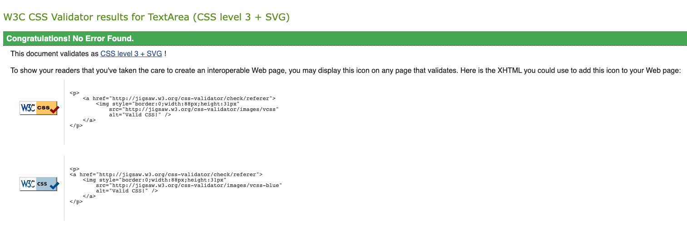

#### Lighthouse Validator
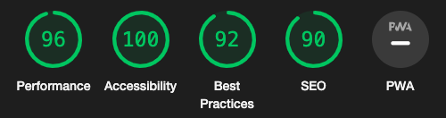
#### CI Python Linter
   - Below python files were passed through [PEP8 validator](https://pep8ci.herokuapp.com/) and no errors were found.
   - admin.py
   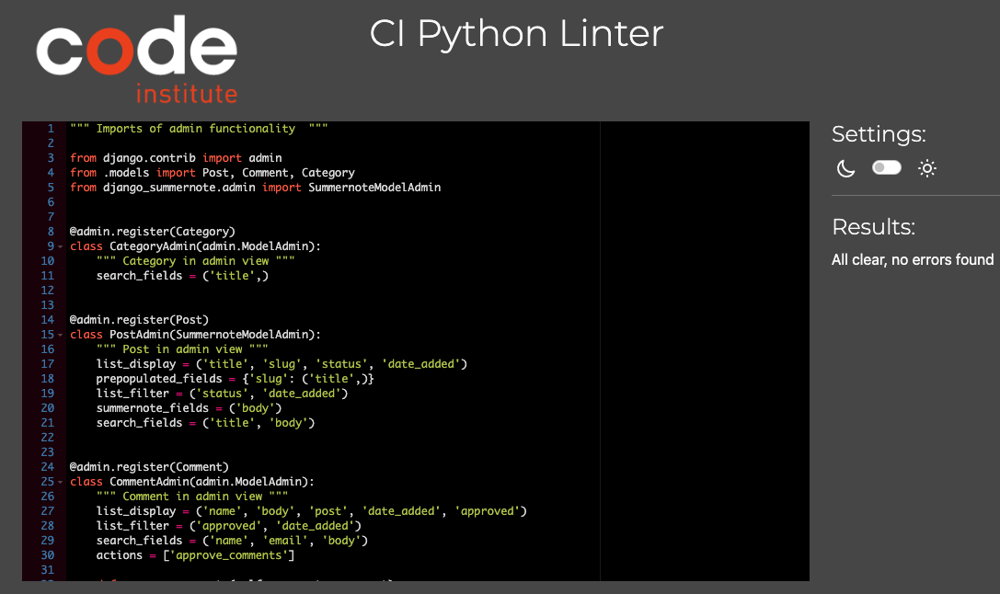
   - apps.py
   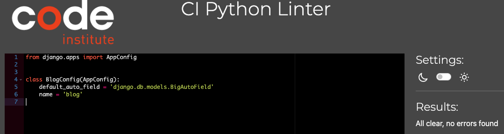
   - forms.py
   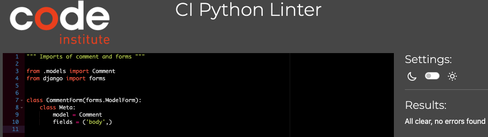
   - models.py
   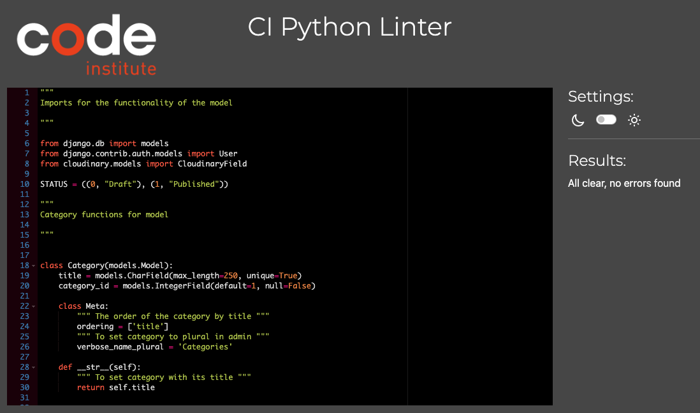
   - urls.py
   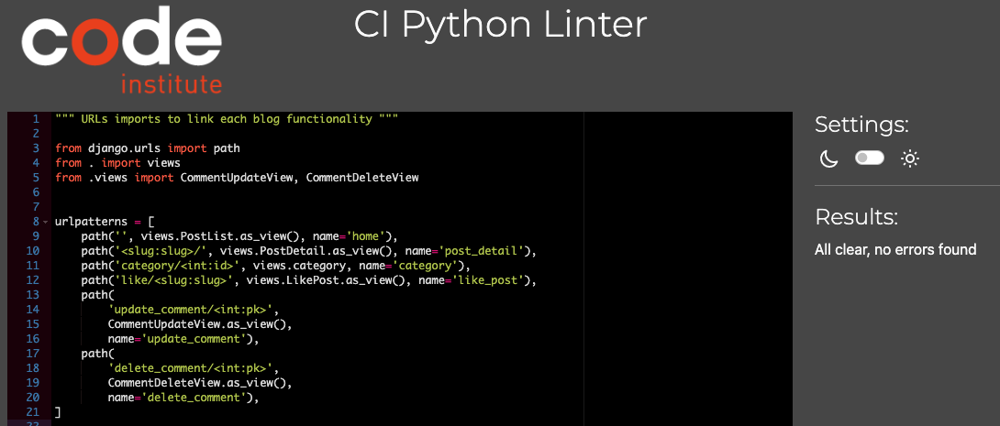
   - views.py
   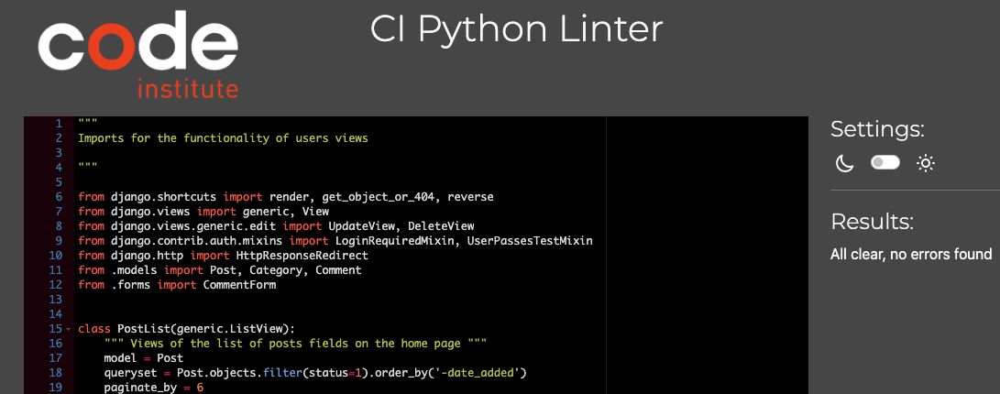

### Bugs Encountered And Solutions:
 - #### Bugs
   There were issues with the fonts and paragraphs for the post details to which was causing errors on the html validator.
   
 - #### Solution
   The structure of the paragraphs were changed to a div and the font code on summernote in admin was also changed to correct the errors.

 - #### Bugs
   During development part, gitpod server number changes at times when running server and causes the browser not to fucntion. 
 - #### Solution
   To solve this I simple had to change the number in the CSRF to correlate with the new number on the gitpod link.

### Unfixed Bugs
   All bugs were fixed before the submission of this project.

## Deployment
The following instructions will provide you with information on how to Deploy to Heroku successfully from setting up Django to Deploying to Heroku.

### Step 1
   - #### Installing Django and Supporting Libraries in the Terminal
      - Install "pip3 install django gunicorn"
      - Install "pip3 install dj_database_url pstcopg2"
      - Install "pip3 install dj3-cloudinary-storage"
      - Create "pip3 freeze --local > requirements.txt"
      - Create "django-admin startproject balln"
      - Create python manage.py startupp blog
      - In settings Add to Installed Apps
      - Migraate changes "python3 manage.py migrate"
      - Run Server to Test "python3 manage.py runserver"

- ### Step 2
   - #### A) Create the Heroku app
      - Log in or Sign up to Heroku.
      - Create new Heroku App
      - Add Database to App Resources
      - Copy DATABASE_URL value

   - #### B) Attach the Database
      - Create new env.py file on top level directory
      - Import os library
      - Set environment variables: os.environ["DATABASE_URL"] = "Paste in Heroku DATABASE_URL Link"
      - Add in secret key: os.environ["SECRET_KEY"] = "Make up your own randomSecretKey"
      - In heroku - Add Secret Key to Config Vars: SECRET_KEY, “With your randon secret key you made up”
    
   - #### C) Prepare our environment and settings.py file
      - Reference env.py 
      - Remove the insecure secret key and replace - links to the SECRET_KEY variable on Heroku 
      - Comment out the old DataBases Section 
      - Add new DATABASES Section 
      - Save all files and Make Migrations: python3 manage.py migrate  

   - #### D) Get our static and media files stored on Cloudinary
      - Add [Cloudinary](https://cloudinary.com/users/login) URL/API_KEY/API_SECRET/API_CLOUD_NAME to Heroku Config Vars
      - Add Cloudinary Libraries to installed apps
      - Tell Django to use Cloudinary to store media and static files
      - Link file to the templates directory in Heroku
      - Change the templates directory to TEMPLATES_DIR
      - Add Heroku Hostname to ALLOWED_HOSTS
      - Create 3 new folders on top level directory 
      - Create procfile on the top level directory
      - Remember to ADD, Commit and Push

- ### Step 3
   - #### Deployment to Heroku
      - Log in or Sign up to [Heroku](https://www.heroku.com/).
      - On dashboard, click "Create New App" or click the "New" dropdown menu on the top right of the page to access "Create New App"
      - On the "Create New App" page, name your app (needs to be a unique name), choose a region and click the "Create App" button.
      - On app page, find and select the "Settings" tab at the top of the page. Scroll down and locate the "Convig Vars" on the settings page.
      - Click "Reveal Config Vars".
      - Change in database - sign up to [Elephantsql](https://www.elephantsql.com/), acquire [Elephantsql](https://www.elephantsql.com/) Database Url and add "Key":DATABASE_URL | "Value": URL supplied by [Elephantsql](https://www.elephantsql.com/) to Heroku
      - Add "Key":Cloudinary URL/API_KEY/API_SECRET/API_CLOUD_NAME | "Value":API environment variable to Heroku Config Vars
      - Add "Key":SECRET_KEY | "Value":Your random secret key
      - Scroll back up and locate the "Deploy" tab and select to access the page.
      - Once on the "Deploy" page, find "Deployment method" section, select "Github" and click the "Connect to Github" button.
      - On "Connect to Github" section, search for your Github repository name you want to deploy by using the empty input field provided and click "Search" to search for the repository name.
      - After clicking "Search", repository name should appear and then click "Connect" button beside it. Now everytime you push to Github, you will be able to deploy on Heroku.
      - Scroll down, to "Automatic deploys" and "Manual deploy" section. You can deploy via these two options.
      - You can set up "Automatic deploys" by clicking on "Enable Automatic Deploys"
      - To deploy manually, click the "Deploy Branch" button.
      - Finally, you'll see "Your app was successfully deployed" pop up message with a "View" button to access the deployed application.

## Credits

### Content/Code
   - [Code Institue](https://codeinstitute.net/) walkthrough video "Hello Django" and "I Think Therefore I Blog" to form the basic Django code for my project. 
   - [Code Institue](https://codeinstitute.net/) walkthrough video to help with installing all the packages, using database correctly and deploying to Heroku.
   - [Code With Stein](https://www.youtube.com/watch?v=m3hhLE1KR5Q) youtube tutorial aided in helping to create models. Also to create the admin page correctly.
   - [Bek Brace](https://www.youtube.com/watch?v=oU9kN13-Xbs) aided to understanding Django framework
   - [Code With Stein](https://www.youtube.com/watch?v=m3hhLE1KR5Q) helped with providing idea on how to create another model.
   - [W3Schools](https://www.w3schools.com/) came very useful to help create bootstrap navigation bars.
   - [Bootstrap](https://getbootstrap.com/) this was used to help form the basic grid structure layout of the page.
   - [Djangocentral](https://djangocentral.com/) helped me to structure my site posts vertically and also helped me to create the comment model.
   - [Data Flair](https://data-flair.training/blogs/django-crud-example/) provided me better understanding on how to go about implementing C.R.U.D.
   - [Stackoverflow](https://stackoverflow.com/questions/73004670/i-want-to-crud-the-comments-of-a-django-user) helped to create the first two parts of C.R.U.D the Create and Read.
   - [geeksforgeeks](https://www.geeksforgeeks.org/django-crud-create-retrieve-update-delete-function-based-views/) helped to create the last two parts of C.R.U.D which is the update and delete.
   - [Bootstrap](https://getbootstrap.com/) helped to create the edit and delete buttons.
   - [Stackoverflow](https://stackoverflow.com/questions/15754424/using-csrf-protect-on-view-get-methods) to help understand csrf_protect.
   - [DJANGO.FUN](https://django.fun/en/docs/crispy-forms/1.12/filters/) used for crispy filter. 
   - [Django (anti)patterns](https://www.django-antipatterns.com/antipattern/checking-ownership-through-the-userpassestestmixin.html) used to restrict access to edit an object in this case the comments.
   - [Code Institue](https://codeinstitute.net/) deployment cheat sheet provide information on how to deploy and used to write README deployment section.

   
### Media
- All images taken from google.

### Acknowledgments
- #### Mentor
   - Thanks to my Mentor for providing me with ideas for project.
   - Thanks to my mentor for the continous feedback during our meetings.
   - Thanks to my mentor for making sure I pass eaxh criteria for the project.
   - Thanks to my mentor for always providing space for me to learn more stuffs and improve my skills as a software engineer.

- #### Tutor Support Team
   - Thanks to Josh for helping me to sort out the my for loop and post structure.
   - Thanks to Jason for helping sort out error messages that occured when created the category model.
   - Thanks to Ger for helping me to sort out linking my categories to my posts.
   - Thanks to Rebecca for helping sort out the bug for when the browser wasn't rendering the comments time stamp.
   - Thanks to Sean for helping sort out that my favicon was appearing.
   - Thanks to Ed for helping sort out the issues I was having when trying to implement restriction of users to edit/delete comments of other users.

- #### Fellow classmates/aluminis on Slack
   - Thanks to my fellow classmate Jared for the moral support and also helping to understand databases.
   - Thanks to Eoghan for providing me with many resources to help aid me with my project.
   - Thanks to Ger for giving tips on how to deploy.
   - Thanks to Jason for helping fix my deployment issues.
   - Thanks to Mikaela for providing information on how to go about forming my project.