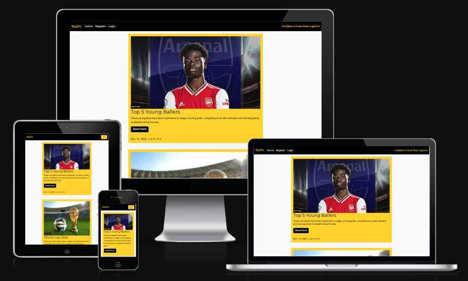

# BallN

Balln is a blog website provided for both football lovers and non football lover who wants to learn more about football and get recent information about what is currently happening in the world of football. There are different posts which provides different information on what to look out for in football right now. It is an interactive page that allows Users to be able to show love for certain poosts and also share their thoughts about what they feel about a particular post in order to invoke conversation. BallN blog allows for convesation to be had and acquiring knowledge about certain topics in football.

[Link to BallN Here!]()

## Contents
- [User Experience (UX)](#User-Experience-UX)
   - [Aim](#Aim)
   - [Target Audience](#Target-Audience)
   - [User Stories](#User-Stories)
      - [First Time Users](#First-Time-Users)
      - [Revisiting Users](#Revisiting-Users)

- [Design](#Design)

- [Features](#Features)
   - [Existing Features](#Existing-Features)
      - [Welcome](#Welcome)
      - [View Songs On Playlist](#View-Songs-On-Playlist)
      - [Submit Songs To Playlist](#Submit-Songs-To-Playlist)
      - [Repeat Or Quit Application](#Repeat-Or-Quit-Application)
      - [Exit Message](#Exit-Message)
      - [Google Worksheet](#Google-Worksheet)
      - [Features Left To Implement](#Features-Left-To-Implement)

- [Technologies Used](#Technologies-Used)
   - [Languages Used](#Languages-Used)
   - [APIs And Libraries Used](#APIs-And-Libraries-Used)
   - [Frameworks, Libraries And Programs Used](#Frameworks-Libraries-And-Programs-Used)
      - [Lucid Chart](#Lucid-Chart)
      - [Git](#Git)   
      - [Gitpod](#Gitpod)
      - [Github](#Github)
      - [Gitpod Python Essentials Template](#Gitpod-Python-Essentials-Template)
      - [Heroku](#Heroku)

- [Testing](#Testing)
  - [Bugs Encountered And Solutions](#Bugs-Encountered-And-Solutions)
  - [Validator Testing](#Validator-Testing)
     - [PEP8 Online](#PEP8-Online)    
  - [Unfixed Bugs](#Unfixed-Bugs)

- [Deployment](#Deployment)

- [Credits](#Credits)
   - [Code](#Code)
   - [Content](#Content)
   - [Media](#Media)
   - [Acknowledgments](#Acknowledgments)

## User Experience (UX)

### Aim

### Target Audience

### User Stories

## Design

## Features

### Existing Features

#### Home

#### About Page

#### Navigation

#### Post detail

### C.R.U.D:

#### Create Comment

#### Read Comment

#### Edit Comment Page

#### Delete Comment Page

#### Admin Page

#### Register Page

#### Login Page

#### Logout Page

### Features Left to Implement

## Technologies Used

### Languages Used

### Frameworks, Libraries And Programs Used

### Installed Packages:

## Testing

### Manual Testing

### Automated Testing

### Validator Testing

### Bugs Encountered And Solutions:
 - #### Bugs

 - #### Solution

### Unfixed Bugs

## Deployment

## Credits

### Code

### Content

### Media

### Acknowledgments
- #### Mentor
  

- #### Tutor Support Team
  

- #### Fellow classmates/aluminis on Slack
  