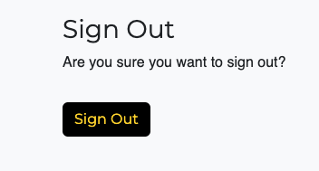

# BallN

Balln is a blog website provided for both football lovers and non football lover who wants to learn more about football and get recent information about what is currently happening in the world of football. There are different posts which provides different information on what to look out for in football right now. It is an interactive page that allows Users to be able to show love for certain poosts and also share their thoughts about what they feel about a particular post in order to invoke conversation. BallN blog allows for convesation to be had and acquiring knowledge about certain topics in football.

[Link to BallN Here!]()

## Contents
- [User Experience (UX)](#User-Experience-UX)
   - [Aim](#Aim)
   - [Target Audience](#Target-Audience)
   - [User Stories](#User-Stories)
   - [User Goals](#User-Goals)
      - [First Time Users](#First-Time-Users)
      - [Revisiting Users](#Revisiting-Users)

- [Design](#Design)
   - [Wireframes](#Wireframes)
   - [Typography](#Typography)

- [Features](#Features)
   - [Existing Features](#Existing-Features)
      - [Welcome](#Welcome)
      - [View Songs On Playlist](#View-Songs-On-Playlist)
      - [Submit Songs To Playlist](#Submit-Songs-To-Playlist)
      - [Repeat Or Quit Application](#Repeat-Or-Quit-Application)
      - [Exit Message](#Exit-Message)
      - [Google Worksheet](#Google-Worksheet)
      - [Features Left To Implement](#Features-Left-To-Implement)

- [Technologies Used](#Technologies-Used)
   - [Languages Used](#Languages-Used)
   - [APIs And Libraries Used](#APIs-And-Libraries-Used)
   - [Frameworks, Libraries And Programs Used](#Frameworks-Libraries-And-Programs-Used)
      - [Lucid Chart](#Lucid-Chart)
      - [Git](#Git)   
      - [Gitpod](#Gitpod)
      - [Github](#Github)
      - [Gitpod Python Essentials Template](#Gitpod-Python-Essentials-Template)
      - [Heroku](#Heroku)

- [Testing](#Testing)
  - [Bugs Encountered And Solutions](#Bugs-Encountered-And-Solutions)
  - [Validator Testing](#Validator-Testing)
     - [PEP8 Online](#PEP8-Online)    
  - [Unfixed Bugs](#Unfixed-Bugs)

- [Deployment](#Deployment)

- [Credits](#Credits)
   - [Code](#Code)
   - [Content](#Content)
   - [Media](#Media)
   - [Acknowledgments](#Acknowledgments)

## User Experience (UX)

### Aim
The aim of this site is to provide a space for people to view post about current matters in football. The site is to bring together numerous football fans around the world connecting via these blog posts. The posts ranges from information about players to football technologies and history about football. The site allows users to be able to interact with the blog posts via likes and comments to spark up conversation and share their thoughts about the post. 

### Target Audience
For all football lovers and non football lovers that would like to view posts about the current state of world football. 

### User Stories
#### Admin Stories
- As a Site Admin I can create, read, update and delete posts so that I can manage my blog content
- As a Site Admin I can create draft posts so that I can finish writing the content later
- As a Site Admin I can approve or disapprove comments so that I can filter out objectionable comments

#### User Stories
- As a Site User I can view a paginated list of posts so that I can select which post I want to view.
- As a Site User I can view a list of posts so that I can select one to read
- As a Site User / Admin I can view the number of likes on each post so that I can see which is the most popular or viral
- As a Site User I can click on a post so that I can read the full text
- As a Site User / Admin I can view comments on an individual post so that I can read the conversation
- As a Site User I can register an account so that I can comment and like
- As a Site User I can leave comments on a post so that I can be involved in the conversation
- As a Site User I can like or unlike a post so that I can interact with the content
- As a Site User I can choose which category of post so that I can read specific posts related to the category of choice

### User Goals

#### First Time Users
- As a first time user, I want to be able access the site.
- As a first time user, I would like information on how to navigate the site.
- As a first time user, I want to be able to register to the site.
- As a first time user, I want to be able to view posts.
- As a first time user, I want to be able to like and unlike posts.
- As a first time user, I want to be able to choose specific categories for posts.

#### Revisting Users
- As a revisiting user, I want to be able to login back into the site.
- As a revisiting user, I want to be able to view posts.
- As a revisiting user, I want to be able to be able to like and unlike posts.
- As a revisiting user, I want to be able to be able to edit own comments.

## Design
### Wireframes
#### Home:

#### Post Detail:

#### Sign In:

#### Sign Up:

### Typography
All fonts from this site were taken from Google Fonts.

## Features

### Existing Features

#### Home

#### Navigation

#### Post Detail

#### Footer Links

### C.R.U.D:

#### Create Comment

#### Read Comment

#### Edit Comment Page

#### Delete Comment Page

#### Admin Page

#### Register Page

#### Login Page

#### Logout Page

### Features Left to Implement

- To add another model to which users are able to like / unlike other users comments.
- To add another model to which users are able to reply to other users comments.
- To add highlight videos of football matches on the home page.

## Technologies Used

### Languages Used
- [HTML5](https://en.wikipedia.org/wiki/HTML)
- [CSS](https://en.wikipedia.org/wiki/CSS)
- [JavaScript](https://en.wikipedia.org/wiki/JavaScript)
- [Python](https://en.wikipedia.org/wiki/Python_(programming_language))
- [Django](https://www.djangoproject.com/)

### Frameworks, Libraries And Programs 

1. #### [Balsamiq](https://balsamiq.com/)
   - Balsamiq was used to create the basic frameworks of the project to which helped to coding the website.

2. #### [Smartdraw](https://www.smartdraw.com/)
   - Smartdraw was used to create my Entity Relationship Diagram to help structure the database scheme.

3. #### [Git:](https://git-scm.com/)
   - Git was used in the Gitpod terminal to add, commit and push code to Github.

4. #### [Gitpod:](https://www.gitpod.io/)
   - Gitpod is the Integrated Developer Environment used to code this project.

5. #### [Github:](https://github.com/)
   - Github was used to hold and keep the pushed codes by Git and store projects.

6. #### [Gitpod Python Essentials Template:](https://github.com/Code-Institute-Org/python-essentials-template)
   - Gitpod Python Essentials Template was provided by code institute and it consisted of all the relevant tools needed for the successful running of the application.

7. #### [Heroku](https://id.heroku.com/login)
   - Heroku was used to deploy the project.

8. #### [PostgreSQL](https://www.postgresql.org/)
   - This was used for database.

9. #### [ElephantSQL](https://www.elephantsql.com/)
   - This was used as the new database.

10. #### [Google Fonts](https://fonts.google.com/about)
   - This was used to form the fonts for the page.

11. #### [Favicon](https://www.favicon.cc/)
   - This was used to create an icon for the site tab.

### Installed Packages:

## Testing

### Manual Testing

### Automated Testing

### Validator Testing

### Bugs Encountered And Solutions:
 - #### Bugs

 - #### Solution

### Unfixed Bugs

## Deployment

## Credits

### Content/Code
   - [Code Institue](https://codeinstitute.net/) walkthrough video "Hello Django" and "I Think Therefore I Blog" to form the basic Django code for my project. 
   - [Code Institue](https://codeinstitute.net/) walkthrough video to help with installing all the packages, using database correctly and deploying to Heroku.
   - [Code With Stein](https://www.youtube.com/watch?v=m3hhLE1KR5Q) youtube tutorial aided in helping to create models. Also to create the admin page correctly.
   - [Bek Brace](https://www.youtube.com/watch?v=oU9kN13-Xbs) aided to understanding Django framework
   - [Code With Stein](https://www.youtube.com/watch?v=m3hhLE1KR5Q) helped with providing idea on how to create another model.
   - [W3Schools](https://www.w3schools.com/) came very useful to help create bootstrap navigation bars.
   - [Bootstrap](https://getbootstrap.com/) this was used to help form the basic grid structure layout of the page.
   - [Djangocentral](https://djangocentral.com/) helped me to structure my site posts vertically and also helped me to create the comment model.
   - [Data Flair](https://data-flair.training/blogs/django-crud-example/) provided me better understanding on how to go about implementing C.R.U.D.
   - [Stackoverflow](https://stackoverflow.com/questions/73004670/i-want-to-crud-the-comments-of-a-django-user) helped to create the first two parts of C.R.U.D the Create and Read.
   - [geeksforgeeks](https://www.geeksforgeeks.org/django-crud-create-retrieve-update-delete-function-based-views/) helped to create the last two parts of C.R.U.D which is the update and delete.
   - [Bootstrap](https://getbootstrap.com/) helped to create the edit and delete buttons.
   - [Stackoverflow](https://stackoverflow.com/questions/15754424/using-csrf-protect-on-view-get-methods) to help understand csrf_protect.
   - [DJANGO.FUN](https://django.fun/en/docs/crispy-forms/1.12/filters/) used for crispy filter. 
   - [Django (anti)patterns](https://www.django-antipatterns.com/antipattern/checking-ownership-through-the-userpassestestmixin.html) used to restrict access to edit an object in this case the comments.

   
### Media
- All images taken from google.

### Acknowledgments
- #### Mentor
   - Thanks to my Mentor for providing me with ideas for project.
   - Thanks to my mentor for the continous feedback during our meetings.
   - Thanks to my mentor for making sure I pass eaxh criteria for the project.
   - Thanks to my mentor for always providing space for me to learn more stuffs and improve my skills as a software engineer.

- #### Tutor Support Team
   - Thanks to Josh for helping me to sort out the my for loop and post structure.
   - Thanks to Jason for helping sort out error messages that occured when created the category model.
   - Thanks to Ger for helping me to sort out linking my categories to my posts.
   - Thanks to Rebecca for helping sort out the bug for when the browser wasn't rendering the comments time stamp.
   - Thanks to Sean for helping sort out that my favicon was appearing.
   - Thanks to Ed for helping sort out the issues I was having when trying to implement restriction of users to edit/delete comments of other users.

- #### Fellow classmates/aluminis on Slack
   - Thanks to my fellow classmate Jared for the moral support and also helping to understand databases.
   - Thanks to Eoghan for providing me with many resources to help aid me with my project.
   - Thanks to Ger for giving tips on how to deploy.
   - Thanks to Jason for helping fix my deployment issues.
   - Thanks to Mikaela for providing information on how to go about forming my project.